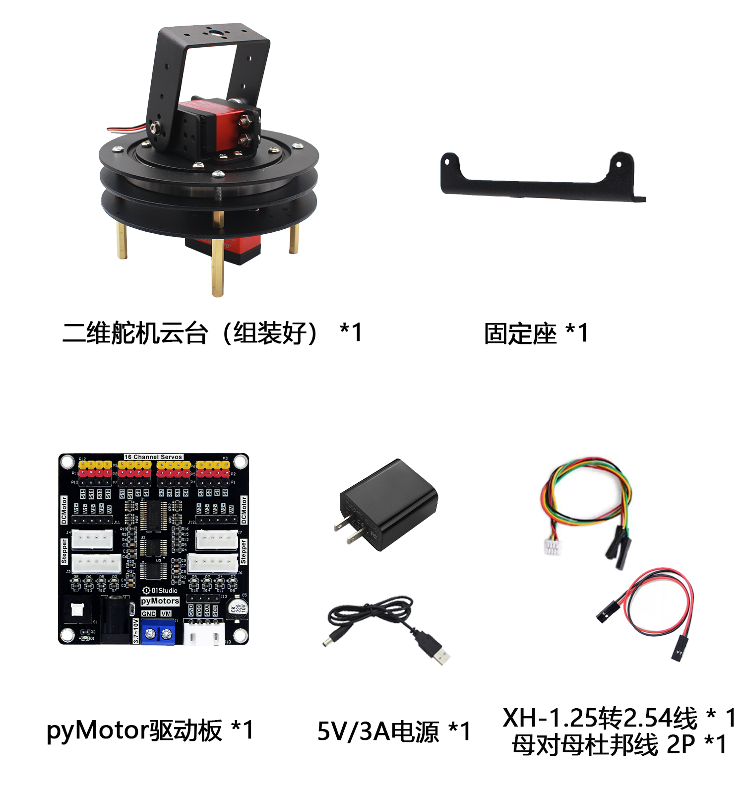
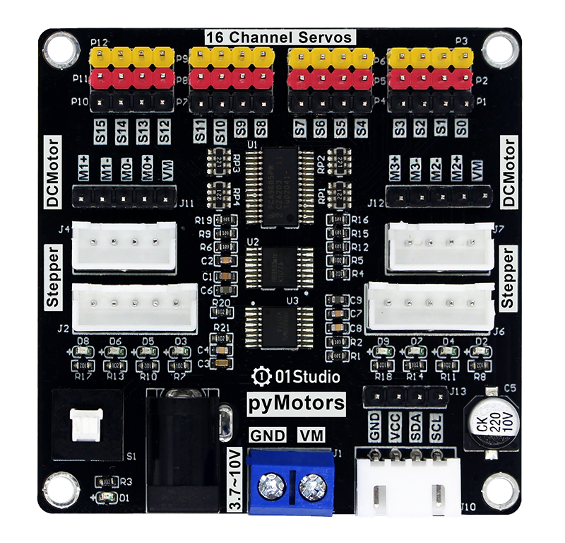
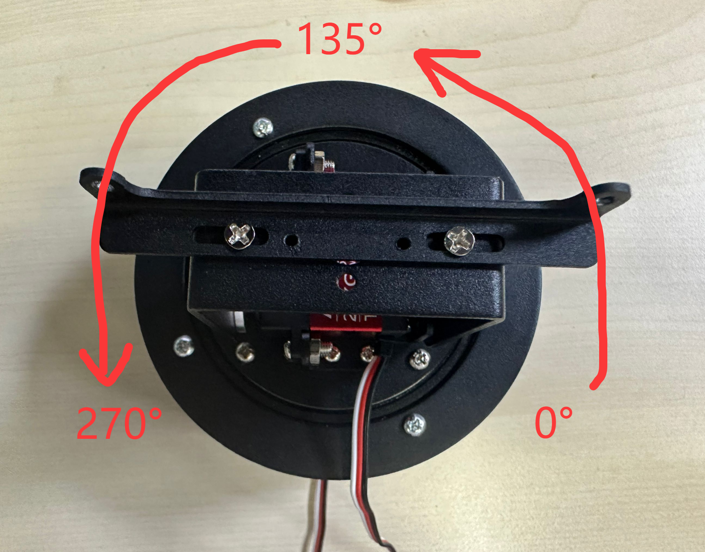
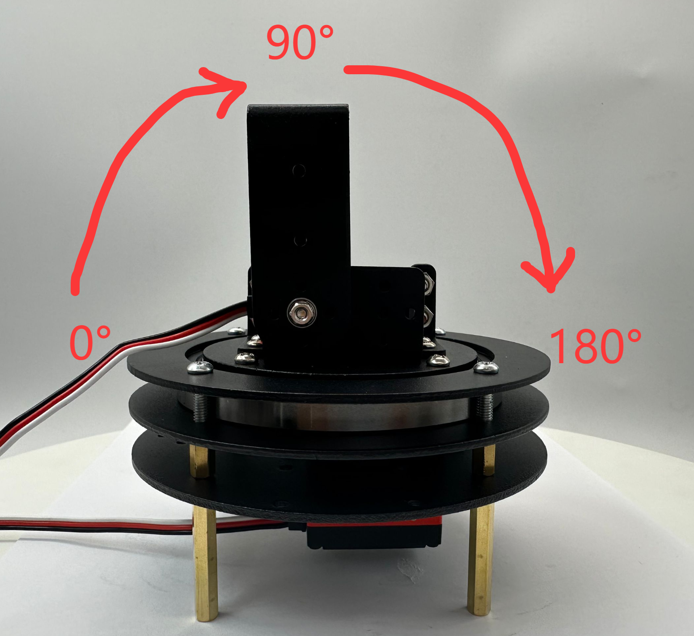
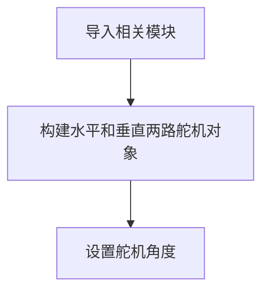
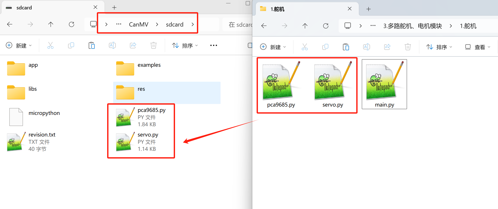
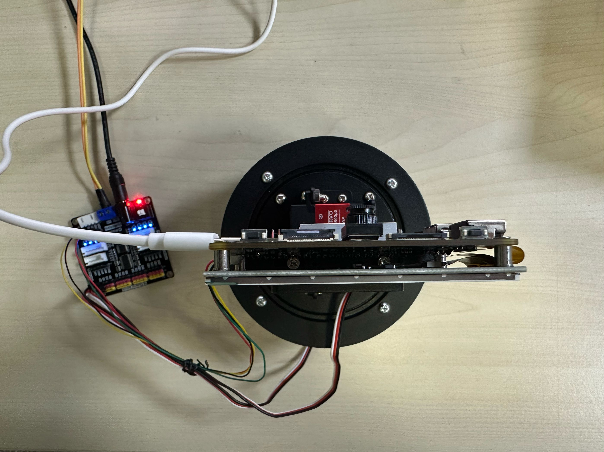

# 云台舵机控制

:::tip 提示
本例程请使用01Studio资料包 2025-7-22 v1.3-70新版本镜像。
:::

## 前言
在前面多路舵机模块章节我们已经讲解过通过如何驱动舵机。这节基于舵机云台我们再来重新讲解一下。

## 实验平台

01Studio CanMV K230开发板和二维舵机云台（含驱动板）。[**点击购买>>**](https://item.taobao.com/item.htm?id=956013958624)



## 实验目的

通过编程实现对二维舵机云台2个维度舵机任意角度的控制。

## 实验讲解

pyMotors多功能电机模块基于PCA9685，这是一款I2C转16路PWM芯片，只需要通过K230的I2C接口即可控制最大16路PWM舵机、4路直流电机、2路42步进电机或4相5线步进电机。电机供电支持3.7V-10V输入。



pyMotors模块资料包：[点击下载>>](https://download.01studio.cc/modules/motor/motors/motors.html)

本教程使用I2C2跟pyMotors模块连接。模块使用5V电源供电。连接方法参考[二维云台组装教程](../gimbal/intro.md#驱动板组装)。

## 舵机出厂角度位置

01Studio二维舵机云台水平（X轴）舵机270°。出厂角度如下：

- 以线在下方为参考点，正前方为居中135°，右下角为0°，左下角为270°。




垂直（Y轴）舵机180°。出厂角度如下：

- 以线在左边为参考点，正上方为居中90°，左边是0°，右边是180°。



## 舵机

舵机通过3线（一般舵机的线序为信号，电源，地）控制，二维舵机云台用到的是20KG大扭矩PWM舵机。通常情况下：黑色表示GND，红色表示VCC，橙色（或白色）表示信号线。


PWM舵机的控制一般需要一个周期20ms（频率50Hz）左右的时基脉冲，该脉冲的高电平部分一般为0.5ms-2.5ms范围内的角度控制脉冲部分，总间隔为2ms。下图以180°舵机为例（-90°到90°，可自行转换为0°-180°），说明了在固定PWM频率下通过不同的脉冲宽度信号即可控制舵机对应角度。**对于270°舵机同理。**


## Servos对象

基于pyMotors方式控制PWM舵机的microppython驱动库已经封装好，位于servo.py和pca9685.py ,只需要在主函数初始化I2C2和调用即可。

#### 构造函数
```python
from servo import Servos

...

s=Servos(i2c, freq=50, min_us=500, max_us=2500, degrees=180) 
```
构建16路舵机对象。
- `freq`:PWM频率，默认为50Hz；
- `min_us`:最小脉冲宽度，默认500us，即上图的0.5ms；
- `max_us`:最大脉冲宽度，默认2500us，即上图的2.5ms；
- `degrees`:舵机角度，默认180°。（270°舵机初始化时赋值270即可）

#### 使用方法
```python
s.position(index, degrees=None)
```
设置某个舵机的位置。

- `index`: 值为 0~15 ，表示16个舵机的编号；
- `degrees`: 舵机的角度；180°舵机值为 0~180，270°舵机值为 0~270.

<br></br>

编程思路如下：



## 参考代码

运行代码前需要将 servo.py和pca9685.py 文件发送到CanMV U盘 `sdcard`根目录。主程序 main.py 代码如下：

```python
'''
# Copyright (c) [2025] [01Studio]. Licensed under the MIT License.

实验名称：二维舵机云台两路舵机控制
实验平台：01Studio CanMV K230 + 二维舵机云台（含pyMotors驱动板）
说明：控制二维舵机云台的两路舵机
'''

from machine import I2C,FPIOA
from servo import Servos
import time

#将GPIO11,12配置为I2C2功能
fpioa = FPIOA()
fpioa.set_function(11, FPIOA.IIC2_SCL)
fpioa.set_function(12, FPIOA.IIC2_SDA)

i2c = I2C(2, freq=10000) #构建I2C对象，推荐频率小于10KHz

#构建二维云台2路舵机对象
servo_x=Servos(i2c,degrees=270) #水平（X轴）使用的是270°舵机
servo_y=Servos(i2c,degrees=180) #垂直（Y轴）使用的是180°舵机

#舵机对象使用用法, 详情参看servo.py文件
#s.position(index, degrees=None)
#index: 0~15表示16路舵机;
#degrees: 角度，0~180/270。

#初始位置，可以修改角度观察现象
servo_x.position(0,135) #水平（X轴）使用使用端口0，转到135°
servo_y.position(1,90) #垂直（Y轴）使用使用端口1，转到90°

while True:
    pass

```

修改下面代码的135和90可以分别控制2路点击转动到不同的角度。

```python
#初始位置，可以修改角度观察现象
servo_x.position(0,135) #水平（X轴）使用使用端口0，转到135°
servo_y.position(1,90) #垂直（Y轴）使用使用端口1，转到90°
```

## 实验结果

将资料包示例程序的库文件全部拷贝到CanMV U盘 `sdcard`根目录：



运行代码，可以看到舵机启动后转动到下面位置。（水平135°居中，垂直90°居中）



:::danger 警告
二维云台舵机工作时力度非常大，调试时候小心夹手！
:::


