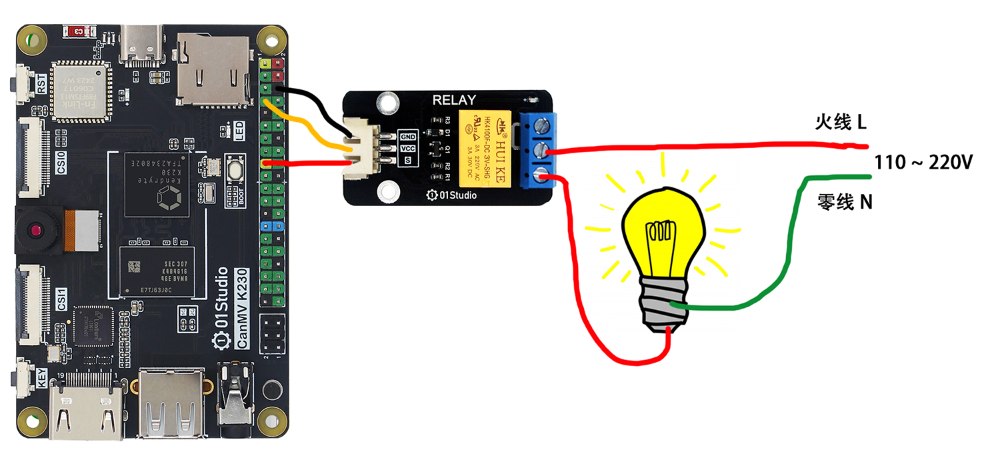
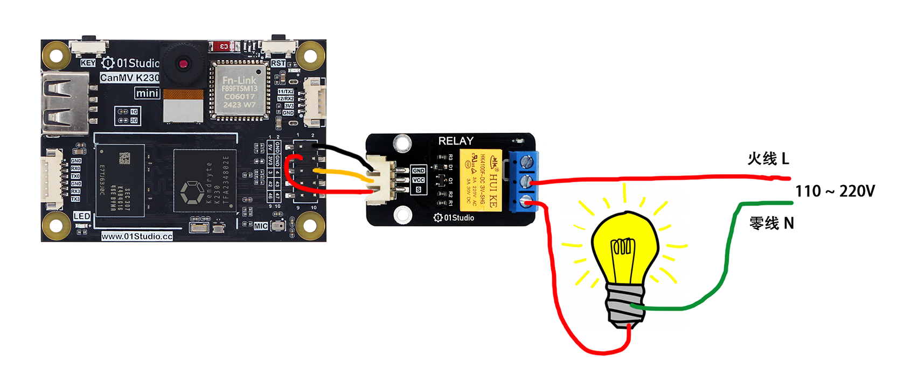
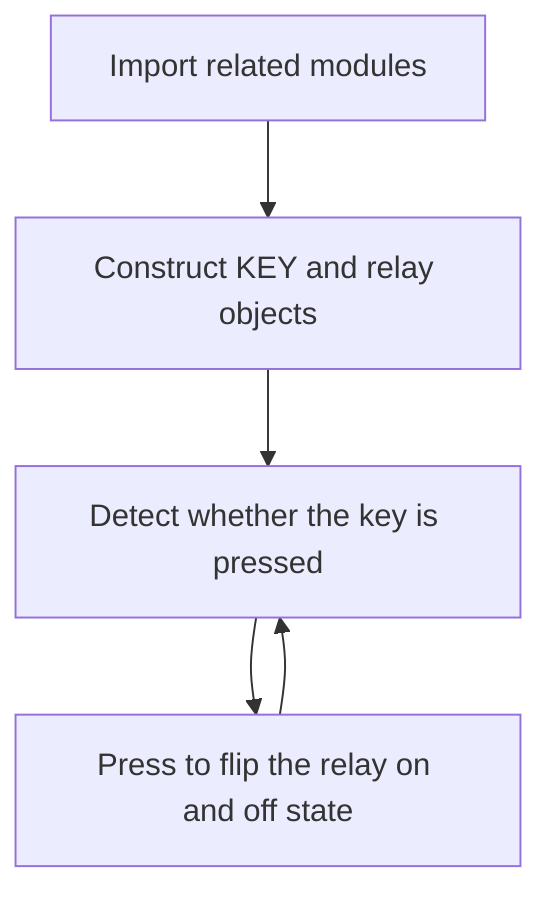
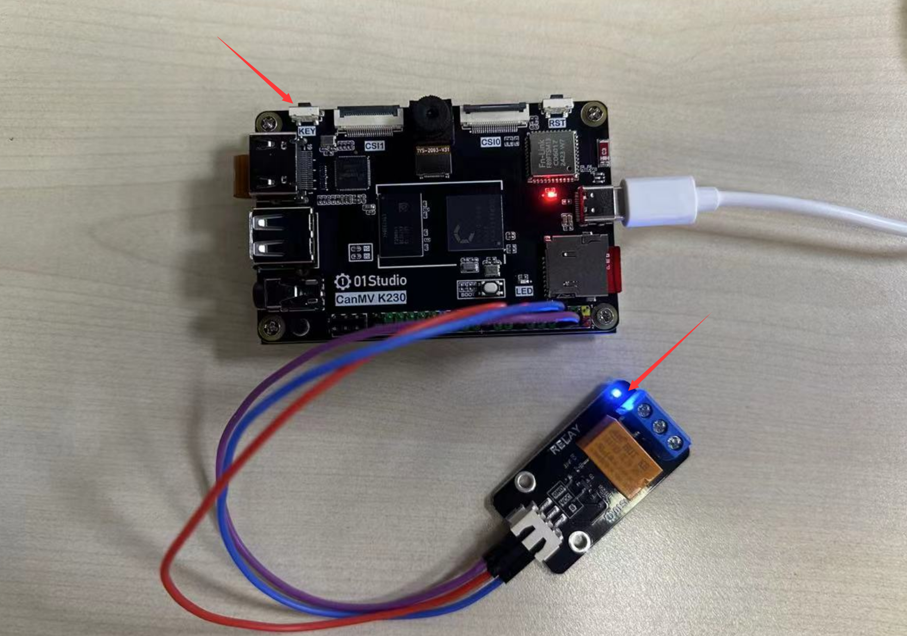

# Relay

## Foreword
We know that the GPIO output level of the CanMV K230 development board is 3.3V, which cannot directly control some high-voltage devices, such as lamps (110~220V). At this time, we can use our commonly used low-voltage control high-voltage components - relays.

## Experiment Purpose
Use the button to control the relay on and off.

## Experimental Explanation

The following figure shows the relay module of 01Studio, which can be powered by 3.3V. The IO output of CanMV K230 can be directly connected to the control end. The low-voltage control interface on the left mainly includes power supply pins and signal control pins (the power supply voltage is generally 3.3V, the specific parameters are subject to the manufacturer). The blue part on the right is the high-voltage part, which can be connected to 110~220V electrical appliances. [**Click to Buy>>**](https://www.aliexpress.com/item/1005001406185993.html)

:::tip Tips

Be sure to use a 3.3V level controlled relay, because the K230 GPIO output is 3.3V, and improper operation using a 5V controlled relay may burn out the development board.

:::


The following figure is a schematic diagram of electrical connection. The left side is the low-voltage control part, and the right side is the high-voltage control part (pay attention to electrical safety when wiring):

- CanMV K230



- CanMV K230 mini




Refer to the [GPIO Introduction](../basic_examples/gpio_intro.md) section to see that the above figure is connected to IO2. Therefore, after the connection, we only need to control the high and low levels of GPIO2 to control the on and off of the relay. We combine the key experiment to achieve the change of the on and off state of the relay every time the key is pressed.

The code writing process is as follows:



## Codes

```python
'''
Demo Name：RELAY
Platform：01Studio CanMV K230
Tutorial：wiki.01studio.cc
Description: Change the on/off state of the relay by pressing the button
'''

from machine import Pin
from machine import FPIOA
import time


#Configure GPIO2 and GPIO21 to normal GPIO mode
fpioa = FPIOA()
fpioa.set_function(2,FPIOA.GPIO2)
fpioa.set_function(21,FPIOA.GPIO21)

RELAY=Pin(2,Pin.OUT) #Build the relay object
KEY=Pin(21,Pin.IN,Pin.PULL_UP) #Build KEY object

state=0 #Relay on/off status

while True:

    if KEY.value()==0:   # The key is pressed
        time.sleep_ms(10) # Eliminate jitter
        if KEY.value()==0: # Confirm that the key is pressed

            state=not state  # Use not statement instead of ~ statement
            RELAY.value(state) # Relay on/off state flip
            print('KEY')

            while not KEY.value(): # Check if the key is released
                pass
```

## Experimental Results

Run the code to control the relay on and off by pressing the button:



The control method of the relay is very simple and has a wide range of uses. Only a simple GPIO high and low level is needed to achieve control.